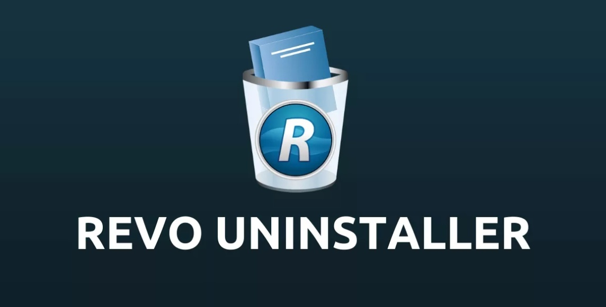

  

# Revo Uninstaller Pro

  

# Revo Uninstaller Pro – Windows Uninstaller

**Revo Uninstaller Pro** is a Windows software uninstaller designed to help users remove installed programs and clean up leftover files, folders, and registry entries. It provides a convenient way to manage unwanted applications on Windows PCs.

## 🔥 Features

* 🗑️ Uninstall unwanted Windows programs
* 🧹 Clean leftover files and folders
* 📝 Remove related registry entries
* 🔍 Scan for leftover application data
* ⚡ Simple and easy-to-use interface
* 💻 Designed for Windows PCs
* 📦 Portable ZIP package
* 🚀 Quick access to the application

## 📥 Download Revo Uninstaller Pro

Download the available Windows package from the GitHub Release:

**[⬇️ Download Revo Uninstaller Pro](https://github.com/surjolive/Revo-Uninstaller-Pro/releases)**

## 🔎 SEO Keywords

Revo Uninstaller Pro, Revo Uninstaller, Windows uninstaller, software uninstaller for Windows, uninstall programs Windows, remove unwanted software, Windows program remover, application uninstaller, clean uninstall Windows, Windows software management, remove leftover files, Windows utility, PC cleanup tool.

## 📌 Compatibility

* **Platform:** Windows
* **Package:** ZIP
* **Release:** V1

> This repository provides a release package for the software. Use software only in accordance with its applicable license and terms.
